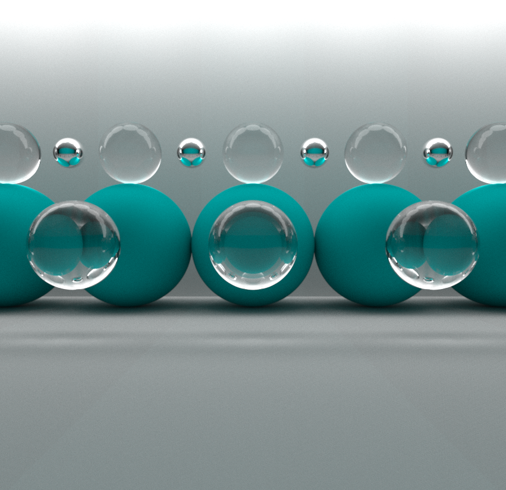

<h2 align="center"> naive_shadertoy_pathtracer</h2>

<strong>A naive glsl implementation of a pathtracer written for shadertoy</strong>

Here is the [shadertoy link](https://www.shadertoy.com/view/WdVfDK).

This is my first attempt at a naive pathtracer. This shader uses Global Illumination
techniques and equations to mimic realistics light behaviour in a given 3d scene.

If you would like to learn more about light rendering and pathtracers I cannot
recommend enough the TU Wien course available for free on Youtube:
https://www.youtube.com/watch?v=pjc1QAI6zS0&list=PLujxSBD-JXgnGmsn7gEyN28P1DnRZG7qi&ab_channel=TwoMinutePapers
This is a big shout-out to TU Wien University and professors Károly Zsolnai and Thomas
Auzinger for making this wonderful course available to everyone on the internet.

This program is heavily based on the basic cpu pathtracer named SmallPaint presented
in the course and improves on it with a much faster convergence using gpu parallelization
instead of simple cpu multithreading. To learn more you can find its source code [here](
https://users.cg.tuwien.ac.at/zsolnai/gfx/smallpaint/)

This is a multipass shader that stores for each pixel the sum of all the previous
ray colors that were shot from the pixel. In the alpha channel we store the total
number of samples that were shot so that we can calculate the average of all the
rays color by the number of rays. We do this in the other shader that is the entry
point of the application.

Feel free to reuse any part of the code that you see. Enjoy!

## Examples 
Here are some images generated in shadertoy (2 minutes/images @ 120 fps):

